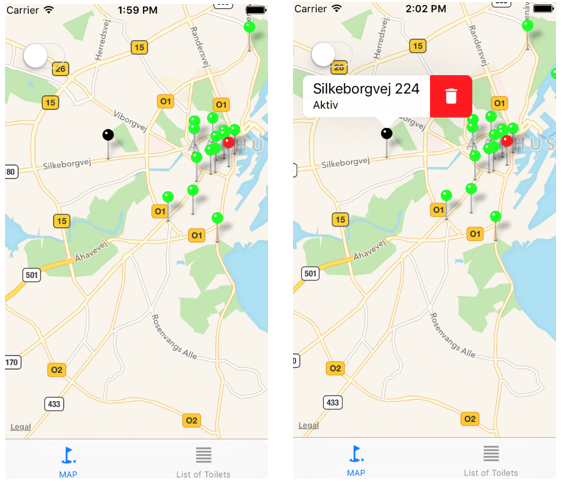
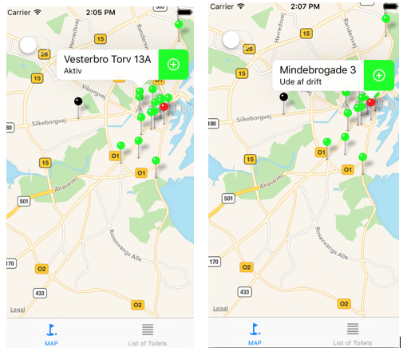
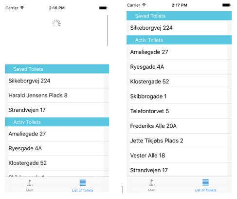

# iMustGo_Swift_Xcode
An iOS app of public toilets in Aarhus. The application reads all data about toilets from a server JSON file.

The app on the front panel shows a zoomed map of Aarhus with pin representation of toilets with their coordinates. Pins are using different colors depending on their status ( Active – Green; Not working – Red) and color BLACK to pins stored locally on the device. When the pin is selected, the popup shows info with the address and status of the toilet. Also is possible to save and delete particular toilet directly on the map.

## Screenshots of the App

```
* The main view with auto zooming to the Aarhus are.
* The black pin means stored on the device, possibility to delete.
```

<p align="center">
  
</p>


```
* Adding to the list as stored Toilets
* Red pin means Toilet NOT Working ( Ude af drift) 
```

<p align="center">
  
</p>


```
*List of Toilets stored on the device.
*Pull down to refresh the table with stored toilets.
```

<p align="center">
  
</p>